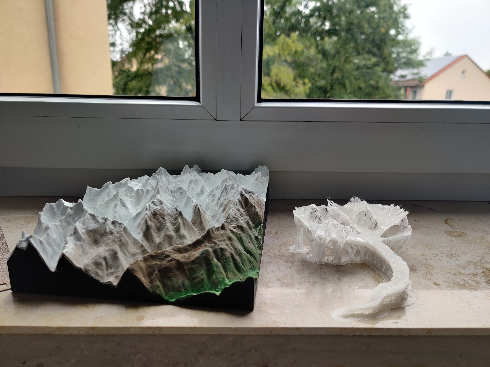

# print-a-glacier

A Python script for generating 3D-printable STL models of glaciers from NetCDF-based glacier datasets. The tool converts gridded ice thickness and surface elevation fields into watertight meshes suitable for 3D prints.

---

## Overview

`print-a-glacier` reconstructs glacier geometry from numerical model output and satellite-derived datasets. It produces two complementary 3D shapes:

- **Terrain**: solid topographic base with vertical boundaries and optional elevation offset
- **Glacier**: watertight ice volume derived from ice thickness and surface elevation fields

I recommend transparent PLA for glacier and painting the Terrain with Acrylcolors after the printing.

---

## Example Output

---

## Input Data

These variables are typically derived from glacier evolution models such as  
[IGM](https://github.com/jouvetg/igm) and [OGGM](https://github.com/OGGM/oggm).
The tool assumes structured NetCDF input with the following variables:

- `x` — projected x-coordinates  
- `y` — projected y-coordinates  
- `thk` — ice thickness (m)  
- `usurf` — glacier surface elevation (m a.s.l.)

---

## Steps

The pipeline consists of the following steps:

1. Load structured NetCDF glacier dataset
2. Compute bedrock topography:  
   \( b = usurf - thk \)
3. Extract glacier extent using thresholded ice thickness
4. Construct surface triangulation via Delaunay tessellation
5. Filtering long edges
6. Export STL geometry

---
